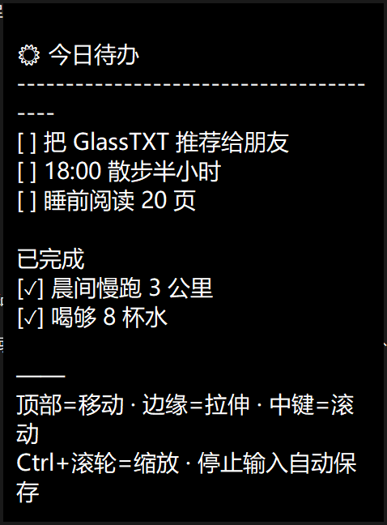
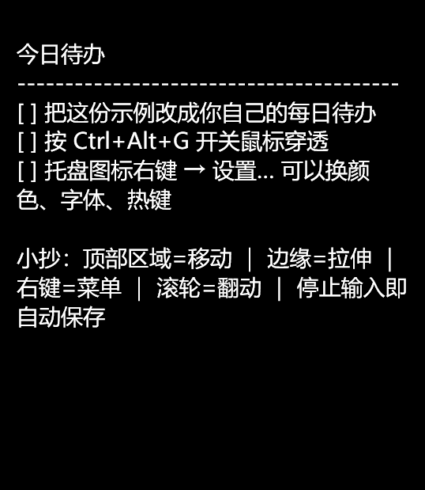
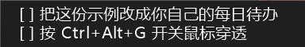
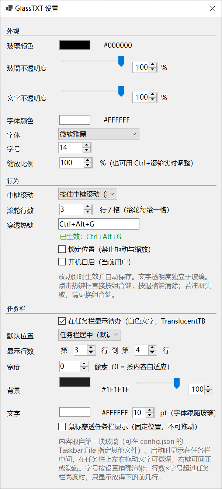

# GlassTXT 1.4 — 桌面玻璃 TXT 便签

一块漂浮在桌面上的无边框、半透明 TXT 编辑窗，专为"每日待办常驻桌面"设计：
没有菜单栏、没有标题栏、不出现在任务栏和 Alt+Tab 里，停止输入自动保存，
还可以一键"鼠标穿透"让它完全不妨碍你操作其他窗口。

```
看得到的：一块玻璃 + 右下角托盘图标
看不到的：标题栏 / 菜单栏 / 任务栏项 / 保存按钮
```

## 使用效果

把每日待办放在桌面上，直接编辑并自动保存。





## 1.4 更新

- 新增**任务栏显示**：把玻璃中第 N–M 行待办以白色文字常驻任务栏，半透明底色贴合 TranslucentTB 的视觉效果
- 浮层直接嵌入任务栏窗口，任务栏自动隐藏或全屏时随之消失；宽度、字号、颜色、不透明度均可设置
- 启动时放在任务栏中间（可选托盘左侧/最左侧），在任务栏上左右拖动即可微调位置，支持鼠标穿透

## 1.3 更新

- WinForms 外壳搭配单个 WPF 玻璃窗口，背景与文字真正独立透明。
- 两种不透明度均支持 0%–100%，滑块与数字输入框双向同步。
- 恢复文字右键的剪切、复制、粘贴、全选，同时保留玻璃操作菜单。
- 改善设置分组、去除设置页滚动条，修复缩放、滚动和关闭保存。
- 首次自动生成的待办文件附带使用说明，已有文件不会被覆盖。

## 快速开始

1. 从 [v1.4.0 Release](https://github.com/chenzhaoxuan0/GlassTXT/releases/tag/v1.4.0) 下载单个 `GlassTXT.exe`，放到有写入权限的文件夹后运行，无需 ZIP 或安装程序
   - 首次运行会在同目录生成 `todo.txt`（带示例内容）和 `config.json`
   - exe、todo.txt、config.json 永远待在一起——整个文件夹拷到别的电脑，配置跟着走
   - 需要 Windows x64 和 [.NET 10 Desktop Runtime](https://dotnet.microsoft.com/download/dotnet/10.0/runtime)（桌面运行时）
   - 升级前从托盘退出旧进程，只替换 EXE；保留自己的配置和 TXT。新说明不会覆盖已有的 `todo.txt`
2. 直接打字编辑，停顿约半秒自动保存；窗口失焦时立即保存
3. 开机自启：托盘 → 设置… → 勾选"开机自启"（写当前用户注册表）

## 操作一览

| 想做什么 | 怎么做 |
| --- | --- |
| 移动玻璃 | **按住玻璃顶部约一行高的隐形拖动区拖动**（鼠标移上去光标会变成移动箭头）；也可 `Alt + 左键` 在任意位置拖动，或按住玻璃四周 12px 的空白圈拖动 |
| 调整大小 | 鼠标贴到玻璃边缘约 6px，光标变缩放箭头后拖动 |
| 滚动内容 | 滚轮 / 方向键 / PageUp·PageDown（无滚动条） |
| 中键滚动 | 三档可选（设置页"行为 → 中键滚动"）：**按住中键滚动**（默认，拖动位移决定速度，松开即停）/ **点一下持续滚动**（任意点击/Esc/失焦退出）/ **关闭**。滚动中光标为上下箭头 |
| 缩放 | **Ctrl+滚轮** 放大/缩小，玻璃上方实时显示倍率；也可在设置页改"缩放比例"（50%–300%），全局生效并记忆 |
| 滚轮行数 | 滚轮每滚一格滚动几行，设置页可调（1–10，默认 3） |
| 右键菜单 | 文字区域提供剪切 ／ 复制 ／ 粘贴 ／ 全选，并提供设置… ／ 回正位置 ／ 隐藏 ／ 退出；**若关闭的是最后一块玻璃，程序整体退出，托盘图标一并消失** |
| 鼠标穿透 | 托盘勾选"鼠标穿透"，或全局热键 `Ctrl+Alt+G` |
| 打开别的 txt | 把 `.txt` 拖到玻璃上（会开一块新玻璃）；或命令行 `GlassTXT.exe D:\notes.txt` |
| 任务栏显示 | 托盘 → 设置… → 任务栏 开启；在任务栏上**左右拖动文字**调整位置，右键可回正或隐藏 |
| 多块玻璃 | 再次双击 exe 即可（自动并入同一进程，托盘只有一个图标）；位置大小按文件各自记忆 |
| 玻璃不见了 | 托盘 → 回正位置（回主屏正中）；或"显示/隐藏玻璃"（显示时若在屏幕外会自动回正） |

关于穿透：

- 穿透开启后，鼠标点击会**完全穿过玻璃**直达后面的窗口，玻璃本身点不到——想编辑先取消穿透
- 热键是全局的：`Ctrl+Alt+G`（可在设置页改成任意组合键，或退格清除停用）
- 热键语义：当前有任意一块玻璃在穿透 → 全部关闭穿透；全部正常 → 全部开启穿透
- 若提示"注册失败"，说明组合键被其他软件占用，换一个即可，不影响其他功能

## 任务栏显示（TranslucentTB 风格）

在设置页勾选"在任务栏显示待办"后，玻璃里选定的行会以白色文字显示在任务栏上，
半透明底色让文字像 TranslucentTB 处理过的任务栏一样融入系统。



- **显示内容**：可选"第 N 行 到 第 M 行"（从上往下数，含两端），玻璃内容一改任务栏立即同步
- **内容来源**：默认取第一块玻璃；要固定某个文件，可在 `config.json` 里把 `Taskbar.File` 设为其完整路径
- **位置**：启动时显示在任务栏**中间**（设置页可改为"系统托盘左侧 / 任务栏最左侧"），在任务栏上按住文字左右拖动可微调，位置会记住；右键菜单提供回正与隐藏；勾选"鼠标穿透"后整块区域点击穿透、位置固定
- **宽度**：默认按内容自适应，也可设为固定像素宽度，超宽的行自动截断为省略号
- **字号**：按设置精确渲染（7–24pt，不自动缩放），字体跟随玻璃字体；行数×字号超过任务栏高度时，从起始行开始只显示放得下的行数
- **稳定跟随**：浮层嵌入任务栏窗口本身，任务栏自动隐藏或全屏播放时随之消失，不会悬浮在全屏画面上；不做后台轮询，若重启了资源管理器（任务栏重建），重启一次 GlassTXT 即可恢复显示

## 托盘菜单

```
显示/隐藏玻璃
鼠标穿透        ✓（勾选 = 穿透中）
回正位置
────────────
设置…
退出            （关闭全部玻璃并保存）
```

双击托盘图标 = 显示/隐藏玻璃。

## 设置页（改动即时生效并自动保存）



- **外观**（对所有玻璃全局生效）：玻璃颜色、玻璃不透明度 0%–100%、文字不透明度 0%–100%、字体颜色、字体、字号、缩放比例 50%–300%
- **行为**：中键滚动模式（按住滚动 / 点一下持续滚动 / 关闭）、滚轮行数（1–10）、穿透热键（点击输入框后直接按组合键）、锁定位置（禁止拖动与缩放）、开机自启
- **任务栏**：在任务栏显示待办、默认位置（居中/托盘左侧/最左侧）、显示行范围（第 N–M 行）、宽度、背景颜色与不透明度、文字颜色与字号、鼠标穿透任务栏显示

两个不透明度互相独立：

- **玻璃不透明度**只作用于背景，调低后背景变淡，文字仍保持自身的不透明度
- **文字不透明度**只作用于文字画刷（包括插入光标），调低后文字真正半透明，背景保持不变

托盘、设置页和消息循环保留 WinForms；每块玻璃使用一个 WPF 窗口，通过背景与文字画刷分别合成 Alpha。没有双层玻璃窗口，也没有色键抠图或文字颜色混合模拟。

两种不透明度都可通过滑块或数字输入框调整。输入 0–100 的整数，按 Enter 或离开输入框确认；输入框与滑块双向同步，并自动保存。0% 为完全透明，100% 为完全不透明。背景为 0% 时，完全透明的空白区域会让鼠标穿过；两项均为 0% 时，可通过托盘 → 设置恢复可见度。

**缩放比例**以"字号"为 100% 基准整体放大/缩小文字，`Ctrl+滚轮` 调的是同一个值，滚动时玻璃上方会显示当前倍率。

## config.json 字段

| 字段 | 含义 |
| --- | --- |
| `Appearance.GlassColor` / `FontColor` | 玻璃底色 / 文字颜色（`#RRGGBB`） |
| `Appearance.OpacityPercent` | 玻璃背景不透明度（0–100），不影响文字画刷 |
| `Appearance.TextOpacityPercent` | 文字不透明度（0–100），只影响文字 |
| `Appearance.FontName` / `FontSize` | 字体 / 字号（缩放的 100% 基准） |
| `Appearance.ZoomPercent` | 缩放比例 50%–300%，Ctrl+滚轮与设置页共用 |
| `Behavior.Hotkey` | 穿透热键，如 `"Ctrl+Alt+G"`，`""` 表示停用 |
| `Behavior.LockPosition` | `true` 时玻璃不可拖动、不可缩放 |
| `Behavior.AutoStart` | 开机自启（实际以注册表为准，此项为镜像） |
| `Behavior.MiddleScrollMode` | 中键滚动：`hold` 按住滚动 / `toggle` 点一下持续滚动 / `off` 关闭 |
| `Behavior.WheelLinesPerNotch` | 滚轮每滚一格的行数（1–10，默认 3） |
| `Taskbar.Enabled` | 是否在任务栏显示待办（默认关闭） |
| `Taskbar.StartLine` / `EndLine` | 显示第几行到第几行（1 起算，含两端） |
| `Taskbar.Position` | 默认停靠位置：`center` 任务栏居中（默认）/ `tray` 系统托盘左侧 / `left` 最左侧 |
| `Taskbar.OffsetX` | 相对默认停靠点再向左的偏移像素，拖动后自动记录 |
| `Taskbar.BackgroundColor` / `BackgroundOpacityPercent` | 任务栏底色（默认 `#1F1F1F`）与不透明度 0–100；不透明度设为 0 即去掉背景，只留文字 |
| `Taskbar.TextColor` / `TextOpacityPercent` | 文字颜色（默认白色）与不透明度 0–100 |
| `Taskbar.FontSize` | 任务栏字号 7–24pt，按设置精确渲染，字体族跟随玻璃字体 |
| `Taskbar.Width` | 任务栏显示宽度（逻辑像素，0 = 按内容自适应），超宽的行截断加省略号 |
| `Taskbar.ClickThrough` | `true` 时任务栏显示鼠标穿透、位置固定 |
| `Taskbar.Position` | 默认停靠位置：`center` 任务栏居中（默认）/ `tray` 系统托盘左侧 / `left` 最左侧 |
| `Taskbar.OffsetX` | 相对默认停靠点再向左的偏移像素，拖动后自动记录 |
| `Taskbar.File` | 内容来源文件完整路径；留空 = 第一块玻璃 |
| `Windows` | 每个绑定文件上次的位置和大小，使用屏幕物理像素，兼容 v1.1 |

手改配置文件后重启程序生效；改坏了直接删掉，会按默认值重建。

## 编码说明

- 读取：自动识别 UTF-8（含 BOM）、UTF-16、GBK
- 保存：统一写回**无 BOM 的 UTF-8**
- 因此 GBK 编码的老文件在首次编辑后会被永久转码为 UTF-8（不可逆），需要保留 GBK 的文件请勿用本工具编辑

## 构建与分发

- 本机构建：双击 `build.bat`（需 .NET 10 SDK），产物在 `publish\GlassTXT.exe`（依赖 .NET 10 桌面运行时）
- 发给没装运行时的机器：

  ```bat
  dotnet publish GlassTXT.csproj -c Release -r win-x64 --self-contained true -p:PublishSingleFile=true -o publish-sc
  ```

## 源码结构

仓库当前源码树只保留源码、测试源码、项目文件、构建脚本、图标、README、许可证及 README 使用的展示图片（docs/）。配置、TXT、日志、编译产物、其他截图及本地方案文档不上传。可执行程序仅通过 Releases 分发。

```
GlassTXT.csproj      项目文件（net10.0-windows + WinForms + WPF）
GlobalUsings.cs      全局 using
Program.cs           入口：默认文件解析、单实例转发、异常日志
AppHost.cs           WinForms 消息循环上下文、托盘与热键生命周期
App.cs               应用状态：玻璃列表、穿透/显隐/回正、命名管道 IPC
GlassWindow.cs       WPF 玻璃：独立 Alpha、编辑、拖动缩放、自动保存、滚动、拖拽
SettingsForm.cs      设置页：取色、透明度、缩放、字体、热键捕获、自启
TrayController.cs    托盘图标与菜单
HotkeyWindow.cs      全局热键注册（RegisterHotKey）
Hotkey.cs            热键文本与按键参数互转
Overlays.cs          穿透小浮层（缩放倍率徽标）
TaskbarOverlay.cs    任务栏待办浮层（嵌入 Shell_TrayWnd 的逐像素 alpha 分层窗）
Config.cs            配置读写、取色工具、开机自启
TextFile.cs          txt 读写（UTF-8/BOM/GBK → UTF-8）
NativeMethods.cs     Win32：窗口扩展样式、拖动、热键、滚动、GBK 解码
tests/              Windows 集成回归与透明度像素检查
docs/screenshot.png    README 使用效果图
docs/screenshot2.png   README 使用效果图（浅色特写）
docs/renwulan.png      README 任务栏显示截图
docs/settings2.png     README 设置页截图（含任务栏分组）
```

## 回归验证

```powershell
dotnet run --project tests/GlassTXT.Tests.csproj
```

测试使用独立配置目录、绑定文件和命名管道，不读写正式版的 `publish/config.json` 或绑定文件。运行时会短暂打开测试窗口。实机输入验收可使用：

```powershell
dotnet run --project tests/GlassTXT.Tests.csproj -- --interactive
```

交互测试窗口仅为便于工具定位而显示任务栏入口，关闭玻璃即结束测试。输入法候选框、实际鼠标拖拽、混合 DPI 多屏仍建议实机验收。

## 下载

前往 [Releases](https://github.com/chenzhaoxuan0/GlassTXT/releases) 下载单个 `GlassTXT.exe`（需安装 [.NET 10 桌面运行时](https://dotnet.microsoft.com/download/dotnet/10.0/runtime)；自包含版可自行按上文命令编译）。首次无参数运行会在 EXE 旁生成带使用说明的 `todo.txt`；GitHub 自动提供的源码压缩包不是必需下载项。

## 开源许可

[MIT](LICENSE) © 2026 chenzhaoxuan0 —— 欢迎自由使用、修改与分发。
